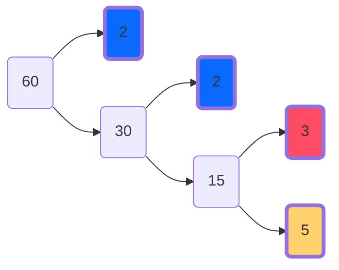

For the next two months I am working in Hong Kong. While I'm here I think it would be helpful to document my time and the work I'm doing. So that those posts are not completely without context, I will take the next two posts to explain: First - Who I am and how I got here, and second - a proper exposition of the problem I will (at least initially) be working on while I'm here.

<!--more-->

# Who Am I?

I'm a maths student (just finished my second year) at [York University](https://www.york.ac.uk). In my first year I was intent on lining up something interesting to do in the summer break, so I talked to my supervisor and he recommended looking into a programme called the Laidlaw scholarship. The purpose of the program was broadly to encourage undergraduate research. Open to all students with at least two years of their degree left before graduation. This was the deal:

- Suggest a project of your own devising, complete with research plan and personal statement
- If shortlisted then you would also be subjected to a logical reasoning test and interview process
- Selected applicants would receive funding to complete whichever project they put forward in their application, and also be enrolled in a leadership development program.

I knew exactly what I would have _liked_ to work on as a scholarship beneficiary - but I didn't fancy my chances getting it.

## Laidlaw: The Dream Project

There are two little projects I worked on long ago that I never dislodged from my mind and ended up becoming entangled with one another. The story of those two mini projects together tell the story of this bigger project I am now in the middle of. First: learning to code.

### Division problems
I was adamant (to the detriment of my actual exam grades at the time) - I _would_ learn to program. I had tried working through some courses on [codeacademy](https://codeacademy.com) but nothing really stuck, in the end what worked for me was playing around with making my own web-pages/websites[^1]. To would google 'simple programming projects' and complete anything I could. There was one project, simple remit, that really intrigued me. The task was simply to create a web page with two elements: an input box, and a submit button. When you typed a number into the box and hit submit, the idea was that the webpage would then display one of two different responses:

- "Your number WAS a multiple of 6 :)", or:
- "Your number WAS NOT a multiple of 6 :("

Sure, not particularly interesting, but good coding practice I thought. Once I got it working I didn't move on right away but instead tried some variations on the core idea. First: Why six? It could have been any number, so I made the divisor a variable and played around with different values. Once It could handle any divisor I tried the idea of doing two divisibility checks at once - now the program showed two lines when you submitted your number: _Is your number a multiple of 6?_ AND _Is your number a multiple of 4?_. It was still pretty boring. I tried instead not one, not two, but a bunch. At that point it became a bit more interesting.

The output looked like a 20 item checklist. As you cycled through inputs, the lines of text would perform a little dance as the divisors flicked on and off. There was a pleasing sort of pattern to it, the second line oscillating on and off with every next number, the third similar but instead going: on, off, off, on, off off. All of them related but not quite in sync. You could gleam something deeper was going on, but still, all of this information was being displayed in such a quaint way: lines of text of different length either affirming divisibility or stating lack thereof. Surely, _surely_, this should be represented graphically? Just literal check boxes would be superior to these verbose textual descriptions. The problem was: although I could picture in my mind what this far superior graphical replacement would look like, my programming abilities at the time were prohibitive of such an endeavour.

#### Enter a whole number


### Prime Factor Knitting

I'm not sure how I found myself there but at some time, now long distant, I came across [this](http://sonderbooks.com/blog/?p=843) page. The amateur book reviewer and mathematics enthusiast Sondra Eklund had knitted a jumper with an interesting pattern.

The design featured a grid of colourful blocks on a white background. Truthfully, it looked like it could have been a homage to the [international maritime signal flag alphabet](https://www.wikipedia.org/wiki/International_maritime_signal_flags).

It was, in fact, a diagrammatic (knitted) presentation of the numbers 1-100 where the representation of each number depended on its [prime factorization](https://www.wikipedia.org/wiki/International_maritime_signal_flags). The idea was simple:
- Give each number its own square on the grid, then split that square into as many parts as it has prime factors.
- Assign each prime number a different colour, then fill in each square's subdivisions accordingly.

#### Example

The prime divisors of $60$ are $2$, $2$, $3$, and $5$.

If, then, we decided to assign the colours blue, red, and yellow to the primes $2$ $3$, and $5$ respectively (to match the choice Sondra made in her jumper) - the number 60 would be represented with four blocks like this:
 
Or like this perhaps, depending on how you decide to arrange the blocks:


and if you take another look at the jumper you can see that's exactly what has been done:

I loved the design, I loved the concept. I had never seen something like that before. Wouldn't it be nice if there was a nice crisp digital version though? Something that would make a nice abstract looking poster I thought. Rather than a blurry picture of a jumper. I don't think that really does the idea justice. Amazing jumper - not the ultimate, definite presentation of a very neat idea. I thought I'd make my own version...

#### My Attempt

Turns out it's a lot of work! I can't imagine how long it took to knit that jumper - bloody hell. I spent many many hours aligning rectangles of different widths and colors to eventually produce this image:

And although I was vary very proud of it at the time, and quite convinced of my graphic designing abilities, after making many more iterations of the design I now look back on it with fond nostalgia and slight amusement. What stuck with me most about the experience was the tedium of the creation. It was so painfully clear that this was not a task best suited for human completion. It should be possible to draw this diagram with a computer program!

## The Scholarly Life

I made quite a few little projects relating to these prompts over the years. Trying to find a solution, experimenting with different approaches, finding commonalities. I learned slowly but I think I learned a lot. When the suggestion of applying to the Laidlaw scholarship was made to me, I had a fairly clear vision (or so I thought) of the ultimate, pedagogical, artistic, freely accessible, intuitive tool that I wanted to author to solve these two problems, and all the problems that lay in the space between them, and also many problems separate but related. I was enthused. I wanted to make art, and to teach, and inspire curiosity. It went down well, I got the scholarship.

After my first summer of working on the problem, I had not authored such a solution. It turned out my vision was not so clear after all. I spent a lot of time diagramming the problem, and re-diagramming the problem. In some sense what I imagined was simple, it's just that I lacked all of the understanding necessary to render it simple. I learned a lot that summer. Exiting the year without even half the tool I pictured stung though. After all my diagramming I did at least understand what I was trying to achieve in a technical sense, and that knowledge is summarised in this research poster I created to display at the Laidlaw conference we attended last year:

You can see in the top right a more polished version of the graphic inspired by Sondra Ekland's jumper, and along the bottom three images exploring different aspects of the type of divisibility visualisation I described before. In the middle of the poster is my attempt to to explain how my proposed program would go about creating these graphics in a general sense.

The totality of impact and value that summer had cannot really be described, not in a poster or a blog post. I learned a lot, even if I didn't make a shiny program.

Regardless, it's a two year program where a bit of failure (maybe even a lot!) is expected, understood, and appropriately provisioned for. All the better to prepare for the second year. So, the second year - what to do?

## The Second Year

The Laidlaw programme runs internationally at a number of research institutions. There is drive to enable international research collaboration among institutions and scholars. I found the prospect of researching at a different university, and experiencing life elsewhere at the same time very appealing so I looked into my options. The project has been very much self defined and self driven so there was not a clear blueprint for collaboration. My approach was to first find people I wanted to work with by combing through the associated uni's mathematics and computer science faculty for researchers with overlapping interests - then if they were willing to talk to me we would figure out the details as needed.

Without any leads in particular to follow, first I reached out to [David Liu](http://www.cs.toronto.edu/~david/index.html) from Toronto university. Communication was like croquet, passing messages through the appropriate wickets of administration. I was fortunate to have the support of the scholarship to enable communication whatsoever. When a message weaved its way back to me the game was up - David was intrigued, but unfortunately not available to work together over the proposed time period.

It didn't seem wise to force the project to be collaborative if the proper impetus wasn't there, so I was hesitant to contact just anybody. Fortunately, shortly after hearing the bad news about Toronto the Laidlaw team here at York caught word that Hong Kong university was particular keen to cross pollinate scholars in the future. With this new information, I again trawled the faculty pages and found a professor I must have missed first time round, because his research areas fit my project direction incredibly well. This time I was told I could contact the academic directly, so I composed an email to [Professor Wenping Wang](http://www.cs.hku.hk/research/profile.jsp?teacher=wenping) explaining my plans, attaching my research poster and copying in the relevant people - and I heard back the same evening! He was interested in collaborating.

The plans we made (what I will be doing now I'm here) will be outlined in the second part of this blog!

[^1]: It turns out the latter is much harder than the former.
