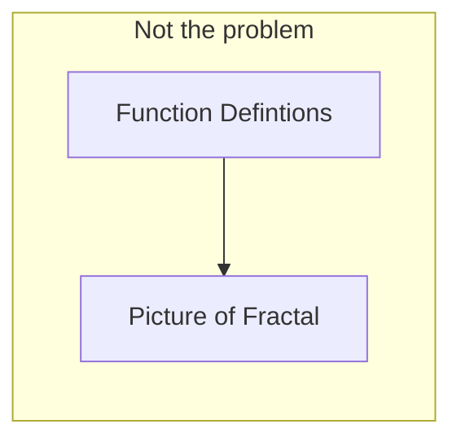
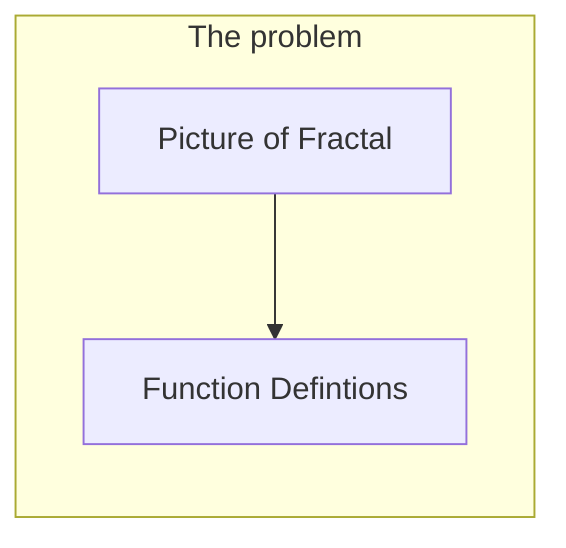
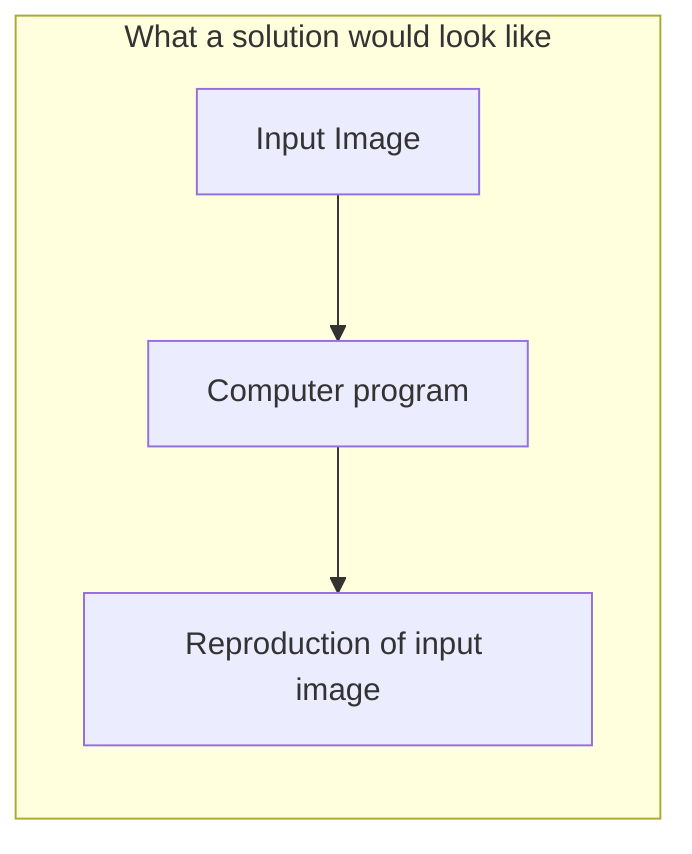
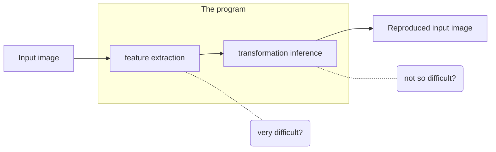

# Changing Tack

Sailing is the art of manoeuvring a vessel to exploit the power of the wind. It is somewhat surprising, and entirely lovely, that this is still possible even when your destination demands that you head directly into the oncoming wind. The wind can be tamed even when it insists on pushing you backwards. Tacking is the name for the type of turn you must perform in order defy the wind's wishes.
{:.info}

In this post I describe the work I'm doing while I'm here. [The last one](joelstrouts.com/2019/07/08/Working-in-Hong-Kong-Part-1.html) explained how I got here, and in doing so described the project I proposed in order to secure the opportunity. If I was working on that same project, an entire additional post to explain what I'm up to would be a bit redundant, so naturally - that's not actually what I'm doing.

## My Options

Here's what happened: First contact with Professor Wang resulted in us scheduling a skype call to talk about the idea of working together - I was supposed to explain my project and describe the expectations I had of the experience. I was quite nervous, but I happily obliged and after ten minutes or so of discussion Professor Wang graciously informed me that my idea was fun, but not of real research interest, then without skipping a beat began to discuss a different problem he had been contemplating. I was blindsided! But the new problem we were discussing was very interesting. Let me try to explain it.

The problem was to do with fractals. The exact definition of a fractal is a bit fussier than the common usage definition (it is more about a sort of scale-independent roughness). In this article we apply the more common definition: A structure is said to be fractal if it exhibits the property of self similarity.

### A Brief Discussion of Fractals

Pictured above is one of the most well known fractals; the Barnsley Fern. Each individual frond looks like a smaller version of the whole thing, this is what we call self similar. Fractals can be dizzyingly complex, but because they follow a pattern, can be described in surprisingly compact ways. Compact representation, complex realisation. That's a desirable combination. If you were dealing with a very complex, incredibly detailed problem, and you realised that actually there was an underlying fractal pattern to it, you would be liberated from worrying about all the fine details. Then you could just reason about the general pattern, since the behaviour would be the same at every level. 

**Two examples:** I learned yesterday that some image compression algorithms work by identifying areas which can be described by fractals, because doing so simplifies the representation so much. Also, many games use fractal rules to generate elements of the environment, like mountain ranges, foliage etc. for the same reason.
{:.info}

The fern pictured above can be generated by the repeated application of these rules:

$$
\bbox[20px, border: 2px solid orange]{
\begin{align}
f_{1}(x,y)=\begin{bmatrix}0.00 & 0.00\\0.00 & 0.16\end{bmatrix}\phantom{-}&\begin{bmatrix}x\\y\end{bmatrix} \\
f_{2}(x,y)=\begin{bmatrix}0.85 & 0.04\\-0.04 & 0.85\end{bmatrix}&\begin{bmatrix}x\\y\end{bmatrix} + \begin{bmatrix}0,00\\1.60\end{bmatrix} \\
f_{3}(x,y)=\begin{bmatrix}0.00 & 0.00\\0.00 & 0.16\end{bmatrix}\phantom{-}&\begin{bmatrix}x\\y\end{bmatrix} + \begin{bmatrix}0,00\\1.60\end{bmatrix} \\
f_{4}(x,y)=\begin{bmatrix}0.00 & 0.00\\0.00 & 0.16\end{bmatrix}\phantom{-}&\begin{bmatrix}x\\y\end{bmatrix} + \begin{bmatrix}0,00\\0.44\end{bmatrix}
\end{align}
}
$$

Where each function is what we call an [_affine translation_](https://www.wikipedia.org/wiki/Affine_transformation), meaning they can be described by a combination of a linear transformation and a translation. Affine transformations let you shift and stretch your input in many ways, only dissalowing changes which would cause straight lines to become curved.

Here you can see visually what those four affine transformations (that were provided in mathematical notation) really describe. Varying the coefficients that define these transformation can produce other fern like outputs and other forms, sometimes natural - often more abstract, too. A gallery of images produced in this way can be found [here](http://paulbourke.net/fractals/ifs/). One such example is shown below.

### The Suggestion

The problem was this: Rather than choosing affine transformations then seeing what image results, is it possible to reverse engineer what the transformations must have been just from the resulting image?

More specifically the question was: can you write a program that would automate this process? Write a program capable of reproducing input images with great accuracy when they contain fractal patterns.

That was pretty much the suggestion. I was not downtrodden that the Professor had expressed his disinterest in working on my original suggestion because he criticisms were reasonable (It is more of an exercise in pedagogy and design than a mathematics/computer science endeavour research) and because I was flattered that despite this he was still interested in working with me and immediately suggested an interesting project that was accessible and relevant to me.

### The Dilemma / The Conclusion

What about my original project? I secured my place on the scholarship program, at least superficially, for the express purpose of realising that idea. So although the prospect on working with Professor Wang at HKU was very exciting, it was not clear that it was the best thing to do. I asked Professor Wang if it would be possible to collaborate but instead divide the time available to work partly on my own project and partly on the problem he suggested. He said that this was in theory possible but not optimal because he would not be able to contribute as much to my project so my being there would be of less use. Very understandable objection! I talked to the scholarship team in York and in the end we decided it was best to take the offer. The scholarship is actually more about personal development than specific project outcomes. The opportunity to learn and grow as a person by taking this chance far outweighed what was offered by the other options available to me. It still feels a bit wrong to abandon my project like that though, so, I have not shelved my project. I'd like to frame what's happening as more of a beating to windward sort of situation - and in the end my project will be the better for it.

## The Plan

So, that is why I am here and that is what I will be working on, although  is not absolutely required that this is the problem we will work on the entire duration of my stay. Perhaps if we reach a dead end, find something more interesting, or perhaps even solve the problem to our satisfaction, we will work on something else. Nevertheless, right now the plan is just to tackle this problem with all our vitality and then reassess the situation periodically.

### Conceptual level

So, my first thought on seeing the problem was that it was really composed of two separate sub-problems. As a person, just from looking at one of these images, the pattern of self similarity is immediately obvious. We have an intuition about it. This frond is like that frond, this stem like that. This is not so obvious to a computer. I think that once you identify how the pattern repeats itself, encoding that as a set of transformations is not so difficult, but identifying the pattern could be very difficult. This is what I saw:

I have talked to Professor Wang and he agrees that this is a natural way of dividing up the problem, and that first I should focus on the second part, initially allowing the feature identification to be an interactive user-driven process.

### Practical Level

I have had a lot of problems choosing the wrong technology in the past. I think I've been too ambitious - trying to optimise for learning potential not just practicality, so choosing something slightly too unfamiliar or demanding, or perhaps with poor support. This time I will try to avoid making the same mistake. Practically, that means I will try:
* Using javascript because I'm more familiar with it,
* Using python because it's well supported
* Using libraries where possible so I don't keep trying to re-invent the wheel

Additionally, my focus right away will just to get something, anything, up and running as quickly as possible as I have often been guilty of analysis paralysis. Soon (by the start of next week?), I hope to be able to embed a barnsley fern that I have generated myself, ideally in an interactive format.

## Obstacles

Generally, thinking of the project as a whole, I see many obstacles. Especially in the second part. For now I'll focus on the near term.

My primary practical concern was, initially, technology. I had talked to the Professor about what technology he would use to implement a demo of a program like this and he suggested $\texttt{c++}$. I have never used $\texttt{c++}$ before so that did worry me a bit. Researching this approach showed me that it would likely involve learning about a graphics library like [OpenGL](https://en.m.wikipedia.org/wiki/OpenGL), which in turn meant learning about graphics pipelines, with shaders and tesselaters, and rasterization. I still want to learn those things but I now see them as secondary to my real target, and perhaps even distractions if I focus on them.

Other than that, I think that the applicability of this approach (entirely affine transformations based) concerns me somewhat. Yes, you can generate many fern like structures this way, even in three dimensions (resulting in a form like a [Romanesco cauliflower](https://en.m.wikipedia.org/wiki/Romanesco_broccoli) but these forms are almost _too_ regular, and I think do not really capture the full breadth of self similar structures.

I must say though, once my short term goal was clear (write a simple program in any language which will generate Bernsley-Fern type fractals and allow you to vary the underlying affine transformations), I felt less bothered by the potential difficulties down the road. First, this - then that.

So tomorrow I begin!
